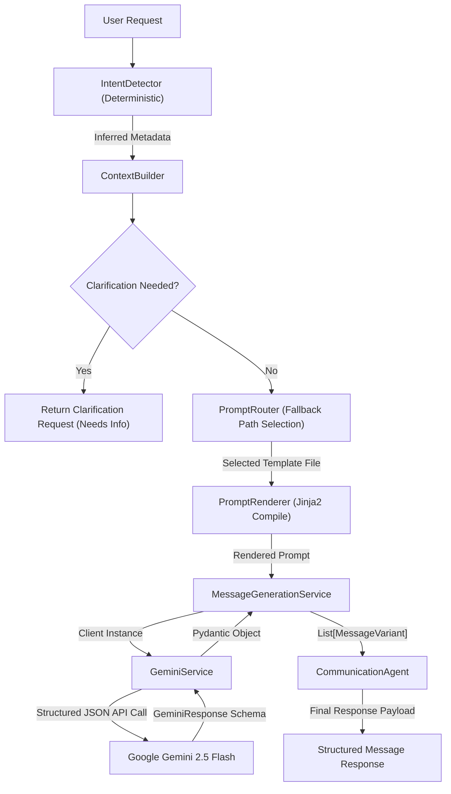

# AI Communication Assistant

[](https://fastapi.tiangolo.com)
[](https://www.python.org)
[](https://ai.google.dev/)
[](https://jinja.palletsprojects.com/)
[](https://opensource.org/licenses/MIT)

AI Communication Assistant is a production-ready backend MVP designed to generate highly contextual, platform-specific message variants. Powered by **FastAPI** and **Google Gemini 2.5 Flash** via the latest `google-genai` SDK, it implements a modular, deterministic agentic pipeline with structured outputs (`response_schema`) and Jinja2-based prompt templates.

---

## Project Status

Backend MVP - Completed

Frontend - In Progress

Deployment - Planned

---

## Why this project?

Communication differs across platforms.

Writing professional emails, WhatsApp messages,
LinkedIn posts, and SMS requires different styles.

This project automates that process using AI.

---

## Table of Contents

- [Project Status](#project-status)
- [Why this project?](#why-this-project)
- [Project Overview](#project-overview)
- [Features](#features)
- [Architecture](#architecture)
  - [Workflow Diagram](#workflow-diagram)
- [Tech Stack](#tech-stack)
- [Folder Structure](#folder-structure)
- [Getting Started](#getting-started)
  - [Prerequisites](#prerequisites)
  - [Installation](#installation)
  - [Environment Variables](#environment-variables)
  - [Running the Application](#running-the-application)
- [API Documentation](#api-documentation)
  - [Health Check](#health-check)
  - [Generate Message](#generate-message)
- [Screenshots](#screenshots)
- [Roadmap & Future Improvements](#roadmap--future-improvements)
- [Contributing](#contributing)
- [License](#license)
- [Author](#author)

---

## Project Overview

Writing messages for different platforms (e.g., a formal email on Gmail vs. a quick update to a family member on WhatsApp) requires adapting tone, format, and style. The AI Communication Assistant automates this process. It accepts raw message inputs and, through a series of deterministic steps, infers the recipient's relationship, desired tone, and purpose, selects the appropriate prompt template, and utilizes Google Gemini to return three optimized message variants.

---

## Features

- **Deterministic Intent Detection**: Scans incoming text for key relationships (e.g., boss, mom, HR), tone, and purpose before invoking the LLM, reducing latency and cost.
- **Context Clarification Engine**: Halts execution and dynamically requests clarification from the user if key metadata (like the platform) is missing, or if intent detection confidence falls below threshold parameters.
- **Jinja2 Template Integration**: Employs Jinja2 templates for prompts, enabling clean variable injection and eliminating syntax clashes with raw JSON examples inside system prompts.
- **Structured Outputs**: Guarantees JSON schema conformance by leveraging the Google GenAI SDK's `response_schema` feature, eliminating the need for fragile regex-based JSON cleaning or manual string parsing.
- **Modular Architecture**: Built with Dependency Injection to allow independent testing and extension of routing, rendering, and generation services.

---

## Architecture

The system utilizes an orchestrator-agent pattern, separating deterministic analysis from LLM generation:

1. **`CommunicationAgent`**: The main workflow orchestrator.
2. **`IntentDetector`**: Evaluates the input message using regex-based keyword mappings, returning values and confidence scores.
3. **`ContextBuilder`**: Merges explicit user inputs with inferred metadata. Validates required inputs and raises clarification questions if necessary.
4. **`PromptRouter`**: Locates the most specific prompt template based on platform, relationship, and tone fallback chains.
5. **`PromptRenderer`**: Compiles the template via Jinja2, populating variables safely.
6. **`LLMFactory`**: Returns the requested LLM client implementation.
7. **`GeminiService`**: Integrates with the `google-genai` SDK, forcing structured output compliance matching the `GeminiResponse` Pydantic model.
8. **`MessageGenerationService`**: Interacts with the LLM and extracts the structured variants.

### Workflow Diagram



---

## Tech Stack

| Technology | Purpose |
| :--- | :--- |
| **FastAPI** | High-performance async web framework |
| **Pydantic v2** | Data validation and JSON schema definitions |
| **Jinja2** | Prompt template rendering engine |
| **Google GenAI SDK** | Latest official library to interact with Gemini API |
| **python-dotenv** | Configurations and environment variable parsing |
| **Uvicorn** | ASGI server implementation |

---

## Folder Structure

```
.
├── app/
│   ├── agents/
│   │   ├── communication_agent.py   # Main orchestrator
│   │   ├── context_builder.py       # Context merging and validation
│   │   ├── intent_detector.py       # Deterministic keyword analyzer
│   │   └── prompt_router.py         # Markdown template selector
│   ├── api/
│   │   └── message.py               # FastAPI routers and route handlers
│   ├── models/
│   │   ├── context.py               # MessageContext schemas
│   │   ├── enums.py                 # Platform, Tone, Relationship, and Language enums
│   │   ├── gemini_response.py       # Pydantic schemas for LLM structured output
│   │   └── message.py               # MessageRequest and MessageResponse Pydantic models
│   ├── prompts/
│   │   ├── default.md               # Global fallback template
│   │   ├── gmail/                   # Email-specific prompt templates
│   │   ├── instagram/               # Caption-specific prompt templates
│   │   ├── linkedin/                # Professional outreach templates
│   │   ├── sms/                     # SMS/Short message templates
│   │   └── whatsapp/                # Chat-specific prompt templates
│   ├── services/
│   │   ├── base_llm.py              # Abstract LLM interface
│   │   ├── gemini_service.py        # Google Gemini LLM Service implementation
│   │   ├── llm_factory.py           # Provider instantiation factory
│   │   └── prompt_renderer.py       # Jinja2 template compiler service
│   └── main.py                      # FastAPI application entry point
├── tests/
│   ├── test_gemini.py               # Basic service verification test
│   └── test_pipeline.py             # End-to-end integration test
├── .env                             # Environment variables
├── requirements.txt                 # Project dependencies
└── README.md                        # Documentation
```

---

## Getting Started

### Prerequisites

- Python 3.10+
- A Google AI Studio API Key (obtain one from [Google AI Studio](https://aistudio.google.com/))

### Installation

1. **Clone the repository:**
   ```bash
   git clone https://github.com/SaiSriHarsha-blip/ai-communication-assistant.git
   cd ai-communication-assistant
   ```

2. **Create and activate a virtual environment:**
   ```bash
   python -m venv .venv
   # On Windows:
   .\.venv\Scripts\activate
   # On macOS/Linux:
   source .venv/bin/activate
   ```

3. **Install the dependencies:**
   ```bash
   pip install -r requirements.txt
   ```

### Environment Variables

Create a `.env` file in the root directory and add your credentials:

```env
GEMINI_API_KEY=your_gemini_api_key_here
GEMINI_MODEL=gemini-2.5-flash
```

### Running the Application

1. **Start the FastAPI development server:**
   ```bash
   uvicorn app.main:app --reload
   ```

2. **Access the API Documentation:**
   - Swagger UI: [http://127.0.0.1:8000/docs](http://127.0.0.1:8000/docs)
   - ReDoc: [http://127.0.0.1:8000/redoc](http://127.0.0.1:8000/redoc)

---

## API Documentation

### Health Check

Verify if the service and database configurations are running properly.

- **URL**: `/health`
- **Method**: `GET`
- **Response Type**: `JSON`

#### Example Response
```json
{
  "status": "ok",
  "project": "AI Communication Agent",
  "version": "0.1.0"
}
```

### Generate Message

Processes a request and returns either a structured message response containing three variants, or a clarification schema.

- **URL**: `/api/v1/generate-message`
- **Method**: `POST`
- **Request Body**: `MessageRequest`
- **Response Type**: `MessageContext` (if clarification needed) or `MessageResponse` (if generated)

#### Example Request (Needs Clarification)
```json
{
  "message": "Hey, sorry I'll be 20 mins late because of traffic."
}
```

#### Example Response (Needs Clarification)
```json
{
  "platform": null,
  "relationship": "family",
  "language": "english",
  "tone": "apologetic",
  "purpose": "inform_delay",
  "needs_clarification": true,
  "missing_fields": ["platform"],
  "question": "Which platform should I prepare this message for? (WhatsApp, Gmail, Instagram, LinkedIn or SMS)"
}
```

#### Example Request (Valid)
```json
{
  "message": "Hey mom, sorry I'll be 30 minutes late for dinner because of heavy traffic.",
  "platform": "whatsapp"
}
```

#### Example Response (Valid)
```json
{
  "original_message": "Hey mom, sorry I'll be 30 minutes late for dinner because of heavy traffic.",
  "messages": [
    {
      "style": "Professional",
      "text": "Mom, I apologize, but I anticipate being approximately 30 minutes late for dinner due to heavy traffic."
    },
    {
      "style": "Friendly",
      "text": "Hey Mom! So sorry, I'm stuck in some really bad traffic and will be about 30 minutes late for dinner."
    },
    {
      "style": "Short",
      "text": "Mom, sorry, 30 mins late for dinner. Traffic."
    }
  ],
  "detected_platform": "whatsapp",
  "detected_relationship": "family",
  "detected_language": "english",
  "detected_tone": "apologetic"
}
```

---

## Screenshots

*Screenshots demonstrating the Swagger UI documentation endpoints, mock requests, and structured JSON results.*

| Swagger Endpoint Overview | Example JSON Structured Output |
| :--- | :--- |
|  |  |

---

## Roadmap & Future Improvements

The current MVP focuses purely on the backend processing core. The planned development cycle includes:

### Current Phase (Completed)
- [x] Backend MVP API setup (FastAPI routes)
- [x] Context analysis and intent detection logic
- [x] Jinja2 templating migration
- [x] Structured output integration (`response_schema`)

### Phase 2: Frontend Client (Planned)
- [ ] Create a React / Next.js single page application
- [ ] Implement chat interfaces and prompt parameter sliders
- [ ] Render interactive clarification modal flows

### Phase 3: Deployment & Monitoring (Planned)
- [ ] Containerization (Docker)
- [ ] CI/CD configuration (GitHub Actions)
- [ ] Deploy serverless APIs to GCP / AWS
- [ ] Add analytics monitoring for token usages and latency

---

## Contributing

Contributions are welcome! Please follow these steps to contribute:

1. Fork the Project.
2. Create your Feature Branch (`git checkout -b feature/AmazingFeature`).
3. Commit your Changes (`git commit -m 'Add some AmazingFeature'`).
4. Push to the Branch (`git push origin feature/AmazingFeature`).
5. Open a Pull Request.

---

## License

Distributed under the MIT License. See `LICENSE` for more information.

---

## Author

**Sai Sri Harsha**
- GitHub: [@SaiSriHarsha-blip](https://github.com/SaiSriHarsha-blip)
- Project Workspace: [ai-communication-assistant](https://github.com/SaiSriHarsha-blip/ai-communication-assistant)
